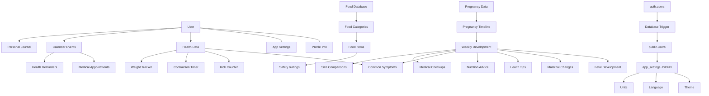
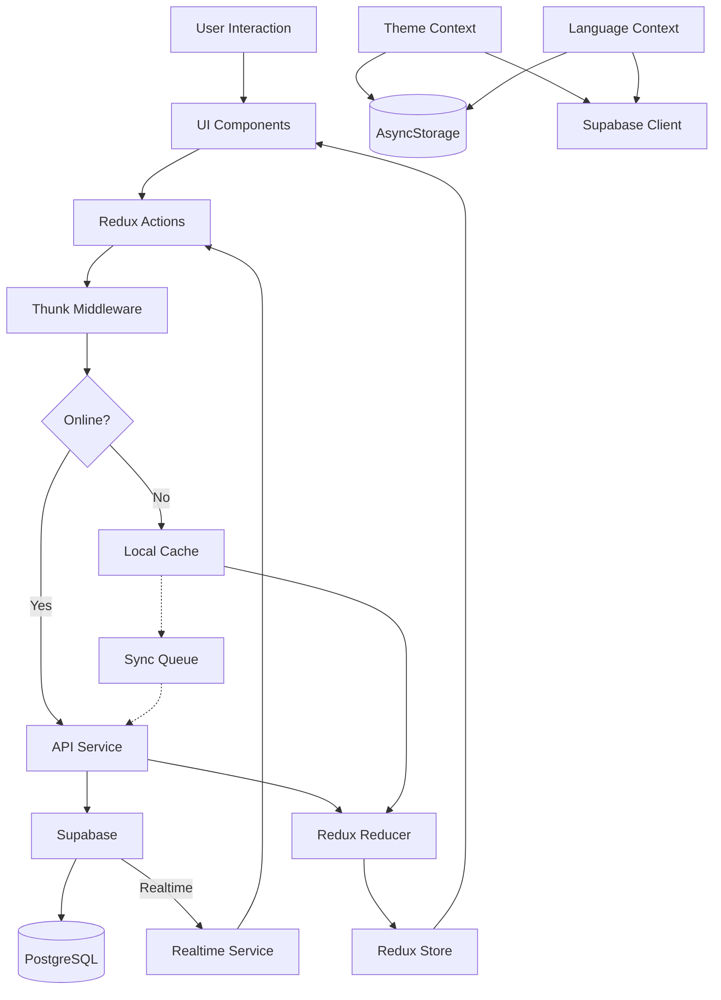

# System Patterns: BumpBuddy

_Version: 1.1_
_Created: 2025-05-06_
_Last Updated: 2025-05-19_

## Architecture Overview

BumpBuddy follows a modular architecture pattern with clear separation of concerns between UI components, state management, and data access. The application is built with React Native and Expo for cross-platform support, using Redux for state management and Supabase as the backend service.

### Key Architecture Components

- **Frontend**: React Native + Expo
- **State Management**: Redux Toolkit
- **Backend**: Supabase (PostgreSQL, Authentication, Storage, Realtime)
- **Offline Support**: AsyncStorage with custom synchronization

## Module Structure

- **Auth Module**: Handles user authentication, registration, and profile management
- **Food Safety Module**: Manages the food database, search, and filtering capabilities
- **Pregnancy Tracker**: Tracks pregnancy progress, fetal development, and provides weekly updates
- **Health Module**: Contains symptom tracker, kick counter, and contraction timer
- **Appointment Manager**: Handles scheduling, reminders, and medical visit tracking
- **Settings & Preferences**: Manages user preferences and app configuration

### Backend Components

- **Supabase Auth**: Handles user authentication and session management
- **PostgreSQL Database**: Stores all application data with proper relations
- **Supabase Storage**: Manages user-uploaded images and media
- **Supabase Functions**: Handles server-side logic and scheduled tasks
- **Supabase Realtime**: Provides real-time updates for collaborative features and live data synchronization
- **Database Triggers**: Automates synchronization between auth.users and public.users tables

## Design Patterns in Use

- **Redux Pattern**: Centralized state management using Redux Toolkit
- **Repository Pattern**: Abstraction layer over data sources (API, localStorage)
- **Provider Pattern**: Context providers for theme, authentication, and configurations
- **Container/Presentational Pattern**: Separation of logic and UI components
- **Observer Pattern**: For real-time updates and notifications via Supabase Realtime subscriptions
- **Strategy Pattern**: For flexible feature implementations based on user preferences
- **Adapter Pattern**: For handling offline/online mode transitions seamlessly
- **Service Pattern**: Used for service abstractions like `timelineService.ts` with caching strategies
- **Caching Pattern**: Implemented for timeline data with expiration policy
- **Decorator Pattern**: Used in theme and language contexts to add persistent storage capabilities
- **Bridge Pattern**: Used to decouple user preferences from their storage/retrieval mechanisms
- **Mediator Pattern**: Implemented in profile management to coordinate updates across components
- **Icon library**: Always use lucide-react icon library

## Data Models and Relationships

### Core Data Models

1. **User Model**

   - Central entity representing the pregnant user
   - Connected to all personal data (health logs, appointments, etc.)
   - Stores pregnancy details (due date, week) and app preferences
   - Synchronized with auth.users via database triggers
   - Contains app_settings for theme, language, and other preferences

2. **Food Safety System**

   - Two-tiered structure with categories and individual foods
   - Enumerated safety ratings (safe, caution, avoid)
   - Rich text descriptions and nutritional data in JSON format

3. **Pregnancy Timeline**

   - Comprehensive week-by-week pregnancy information (weeks 1-40)
   - Contains fetal development, maternal changes, tips, nutrition advice
   - Includes common symptoms, medical checkups, and size comparisons
   - Image references for size visualization

4. **Health Tracking Models**

   - Multiple specialized trackers (symptoms, kicks, contractions, weight)
   - Consistent user linking and timestamp patterns
   - Severity scales for comparative analysis

5. **Appointment System**

   - Date-time based events with reminder capabilities
   - Location and notes for comprehensive planning
   - Integration with device calendar planned

6. **Pregnancy Journey**
   - Reference data for fetal development by week
   - Curated content for each stage of pregnancy
   - Personal journal entries linked to pregnancy weeks
7. **User Preferences**
   - Stored in both AsyncStorage (for fast local access) and database (for cross-device sync)
   - Theme settings (light/dark/system)
   - Language preferences with RTL support when needed
   - Unit system preferences (metric/imperial)
   - Notification settings

### Database Relationships



## Data Flow



## Data Access Patterns

1. **Authentication-Based Isolation**

   - Row-Level Security (RLS) enforces data ownership
   - All user-specific tables include RLS policies that check `auth.uid() = user_id`
   - Prevents unauthorized access to sensitive health information

2. **Reference Data Access**

   - Food database and pregnancy information are read-only for all users
   - No user-specific preferences or modifications stored in reference tables
   - Common data shared across all users to reduce duplication

3. **Offline Data Persistence**

   - Local-first operations with optimistic UI updates
   - Data changes stored in AsyncStorage during offline periods
   - Background synchronization when connectivity resumes

4. **Real-time Data Updates**

   - Realtime subscriptions for personal data changes
   - Immediate UI reflection of database changes
   - Subscription management abstracted behind realtimeService

5. **Cached Data Access**
   - Reference data like pregnancy timeline cached with expiration policy
   - Service layer handles cache invalidation and refreshing
   - Fallback to cached data when network is unavailable
6. **Preference Synchronization**
   - User preferences (theme, language) stored in both AsyncStorage and database
   - Local storage for immediate access and performance
   - Database storage for cross-device synchronization
   - Context providers manage the persistence logic transparently to components

## Key Technical Decisions

- **Cross-Platform Framework**: React Native + Expo chosen for faster development across iOS and Android
- **Backend as a Service**: Supabase selected for its PostgreSQL foundation, real-time capabilities, and open-source nature
- **Offline Support**: Implementation of local storage with IndexedDB through AsyncStorage and custom sync mechanisms
- **State Management**: Redux Toolkit for predictable state management and easier debugging
- **Navigation**: React Navigation for intuitive user flow and deep linking support
- **Testing Strategy**: Jest and React Testing Library for comprehensive test coverage
- **Realtime Implementation**: Supabase Realtime enabled with Metro bundler workarounds for Expo compatibility
- **Database Schema**: Structured with a focus on security, flexibility, and future extensibility
- **Caching Strategy**: 24-hour cache expiration for reference data with manual refresh option
- **User Synchronization**: Database triggers for automatic public.users creation when auth users sign up
- **Preference Storage**: Dual storage in AsyncStorage and database for optimal performance and sync

## Component Relationships

### Authentication Flow

1. User enters credentials in Auth screen
2. Auth actions dispatch to Redux
3. Supabase client attempts authentication
4. On success, JWT stored securely and user profile loaded
5. App state updated to reflect authenticated status
6. Database trigger creates public.users record if it doesn't exist

### Data Synchronization Flow

1. Data changes stored in local Redux store immediately
2. Changes also written to AsyncStorage for offline persistence
3. If online, changes sent to Supabase immediately
4. If offline, changes queued for synchronization
5. When connection restored, queued changes sent to server
6. Conflict resolution strategy applied if server has newer data

### Realtime Update Flow

1. Component mounts and subscribes to relevant channel/table
2. Supabase Realtime listens for PostgreSQL changes
3. When database change occurs, Realtime notifies subscribed clients
4. React component receives update and dispatches Redux action
5. Redux store updates with new data
6. UI automatically re-renders with latest data

### Timeline Data Flow

1. User navigates to Timeline screen
2. Redux checks if timeline data exists in store
3. If not, thunk dispatched to fetch timeline data
4. Timeline service checks local cache in AsyncStorage first
5. If cache valid (less than 24 hours old), cached data used
6. If cache invalid or missing, Supabase query fetches all weeks
7. Data stored in Redux store and AsyncStorage cache
8. UI components render data from Redux
9. Manual refresh option clears cache and forces fresh fetch

### User Preference Flow

1. User changes theme/language in UI
2. Context provider updates local state
3. State change saved to AsyncStorage for immediate local persistence
4. If user is authenticated, preference also saved to database via Supabase
5. Other devices receive update through Realtime subscription
6. Context providers on other devices reflect the updated preferences
7. UI components automatically re-render with new settings

### Feature Module Relationships

- **Auth Module** provides user context to all other modules
- **Pregnancy Tracker** informs content in Health Module
- **Food Safety** and **Health Module** share nutrition-related data
- **Appointment Manager** integrates with device calendar and notifications
- **Settings & Preferences** affects behavior across all modules
- **User Profile** synchronizes preferences across all modules and devices

## Security Considerations

- Sensitive health data encrypted at rest
- Authentication using JWT with secure storage
- Row-level security in Supabase for data isolation
- Database triggers implemented with SECURITY DEFINER to ensure integrity
- Regular security audits and vulnerability testing
- Compliance with health data regulations

## User Profile Schema and Triggers

```sql
-- User table with app_settings for preferences
CREATE TABLE public.users (
    id UUID PRIMARY KEY REFERENCES auth.users(id) ON DELETE CASCADE,
    email TEXT UNIQUE NOT NULL,
    first_name TEXT,
    last_name TEXT,
    created_at TIMESTAMP WITH TIME ZONE DEFAULT NOW() NOT NULL,
    updated_at TIMESTAMP WITH TIME ZONE DEFAULT NOW() NOT NULL,
    due_date DATE,
    pregnancy_week INTEGER,
    birth_date DATE,
    avatar_url TEXT,
    notification_preferences JSONB DEFAULT '{"appointments": true, "weeklyUpdates": true, "foodSafety": true}',
    app_settings JSONB DEFAULT '{"theme": "system", "units": "metric", "language": "en"}'
);

-- Trigger function to sync auth users to public.users
CREATE OR REPLACE FUNCTION public.handle_new_user()
RETURNS TRIGGER AS $$
DECLARE
  system_settings JSONB := '{"theme": "system", "units": "metric", "language": "en"}';
BEGIN
  INSERT INTO public.users (id, email, created_at, updated_at, app_settings)
  VALUES (NEW.id, NEW.email, NEW.created_at, NEW.updated_at, system_settings);
  RETURN NEW;
EXCEPTION
  WHEN OTHERS THEN
    RAISE LOG 'Error in handle_new_user function: %', SQLERRM;
    RETURN NEW;
END;
$$ LANGUAGE plpgsql SECURITY DEFINER;

-- Trigger to create public.users record on auth.users insert
CREATE TRIGGER on_auth_user_created
  AFTER INSERT ON auth.users
  FOR EACH ROW
  EXECUTE FUNCTION public.handle_new_user();

-- Trigger function to sync email updates
CREATE OR REPLACE FUNCTION public.handle_user_update()
RETURNS TRIGGER AS $$
BEGIN
  IF NEW.email <> OLD.email THEN
    UPDATE public.users
    SET email = NEW.email, updated_at = NEW.updated_at
    WHERE id = NEW.id;
  END IF;
  RETURN NEW;
EXCEPTION
  WHEN OTHERS THEN
    RAISE LOG 'Error in handle_user_update function: %', SQLERRM;
    RETURN NEW;
END;
$$ LANGUAGE plpgsql SECURITY DEFINER;

-- Trigger to update public.users when auth.users is updated
CREATE TRIGGER on_auth_user_updated
  AFTER UPDATE ON auth.users
  FOR EACH ROW
  EXECUTE FUNCTION public.handle_user_update();
```

---

_This document captures the system architecture and design patterns used in the project._
