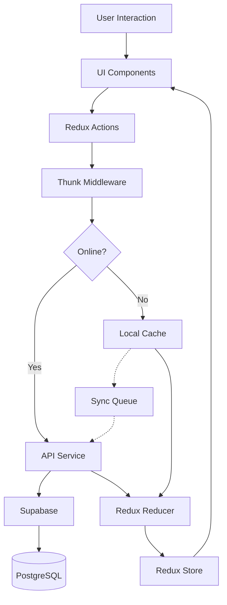

# System Patterns: BumpBuddy

_Version: 1.0_
_Created: 2024-06-09_
_Last Updated: 2024-06-09_

## Architecture Overview

BumpBuddy follows a modern client-server architecture using React Native for the mobile client and Supabase as the backend service. The application implements a hybrid offline-first approach, allowing core functionality to work without an internet connection while syncing data when connectivity is restored.

## Key Components

### Frontend Components

- **Auth Module**: Handles user authentication, registration, and profile management
- **Food Safety Module**: Manages the food database, search, and filtering capabilities
- **Pregnancy Tracker**: Tracks pregnancy progress, fetal development, and provides weekly updates
- **Health Module**: Contains symptom tracker, kick counter, and contraction timer
- **Appointment Manager**: Handles scheduling, reminders, and medical visit tracking
- **Settings & Preferences**: Manages user preferences and app configuration

### Backend Components

- **Supabase Auth**: Handles user authentication and session management
- **PostgreSQL Database**: Stores all application data with proper relations
- **Supabase Storage**: Manages user-uploaded images and media
- **Supabase Functions**: Handles server-side logic and scheduled tasks
- **Supabase Realtime**: Provides real-time updates for collaborative features

## Design Patterns in Use

- **Redux Pattern**: Centralized state management using Redux Toolkit
- **Repository Pattern**: Abstraction layer over data sources (API, localStorage)
- **Provider Pattern**: Context providers for theme, authentication, and configurations
- **Container/Presentational Pattern**: Separation of logic and UI components
- **Observer Pattern**: For real-time updates and notifications
- **Strategy Pattern**: For flexible feature implementations based on user preferences
- **Adapter Pattern**: For handling offline/online mode transitions seamlessly

## Data Flow

## Key Technical Decisions

- **Cross-Platform Framework**: React Native + Expo chosen for faster development across iOS and Android
- **Backend as a Service**: Supabase selected for its PostgreSQL foundation, real-time capabilities, and open-source nature
- **Offline Support**: Implementation of local storage with IndexedDB through AsyncStorage and custom sync mechanisms
- **State Management**: Redux Toolkit for predictable state management and easier debugging
- **Navigation**: React Navigation for intuitive user flow and deep linking support
- **Testing Strategy**: Jest and React Testing Library for comprehensive test coverage

## Component Relationships

### Authentication Flow

1. User enters credentials in Auth screen
2. Auth actions dispatch to Redux
3. Supabase client attempts authentication
4. On success, JWT stored securely and user profile loaded
5. App state updated to reflect authenticated status

### Data Synchronization Flow

1. Data changes stored in local Redux store immediately
2. Changes also written to AsyncStorage for offline persistence
3. If online, changes sent to Supabase immediately
4. If offline, changes queued for synchronization
5. When connection restored, queued changes sent to server
6. Conflict resolution strategy applied if server has newer data

### Feature Module Relationships

- **Auth Module** provides user context to all other modules
- **Pregnancy Tracker** informs content in Health Module
- **Food Safety** and **Health Module** share nutrition-related data
- **Appointment Manager** integrates with device calendar and notifications
- **Settings & Preferences** affects behavior across all modules

## Security Considerations

- Sensitive health data encrypted at rest
- Authentication using JWT with secure storage
- Row-level security in Supabase for data isolation
- Regular security audits and vulnerability testing
- Compliance with health data regulations

---

_This document captures the system architecture and design patterns used in the project._
