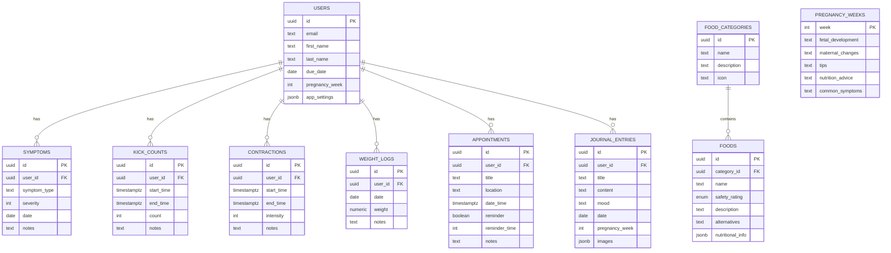

# Technical Context: BumpBuddy

_Version: 1.0_
_Created: 2024-06-09_
_Last Updated: 2024-06-09_

## Technology Stack

- **Frontend**: React Native with Expo
- **Backend**: Supabase (PostgreSQL)
- **State Management**: Redux Toolkit
- **Navigation**: React Navigation
- **Push Notifications**: Expo Notifications
- **Testing**: Jest + React Testing Library
- **CI/CD**: GitHub Actions

## Development Environment Setup

- Project uses Expo SDK 53 and Bun as the package manager
- Supabase client configured for Expo/React Native with AsyncStorage for session persistence
- Metro bundler workaround (`metro.config.js`) disables package exports to avoid Node.js dependency issues with Supabase Realtime
- Babel config updated to whitelist correct environment variables for Supabase
- Realtime enabled and implemented with dedicated `realtimeService.ts` for subscription management

## Dependencies

- **@reduxjs/toolkit**: ^2.0.0 - State management
- **react-redux**: ^8.1.0 - React bindings for Redux
- **@react-navigation/native**: ^6.1.0 - Navigation container
- **@react-navigation/stack**: ^6.3.0 - Stack navigation
- **@react-navigation/bottom-tabs**: ^6.5.0 - Tab navigation
- **@supabase/supabase-js**: ^2.49.4 - Supabase client (Realtime enabled)
- **expo-notifications**: ^0.18.0 - Push notifications
- **react-native-safe-area-context**: ^4.5.0 - Safe area utilities
- **react-native-gesture-handler**: ^2.9.0 - Gesture handling
- **expo-barcode-scanner**: ^12.3.0 - Barcode scanning for food items
- **expo-image-picker**: ^14.1.0 - Image picking for profiles
- **react-native-reanimated**: ^2.14.0 - Animation library
- **react-native-svg**: ^13.9.0 - SVG support for charts and illustrations

## Technical Constraints

- Must maintain offline functionality for core features
- Must ensure data privacy and security for user health information
- Must be compatible with iOS 14+ and Android 9+
- Must follow accessibility guidelines for pregnant users
- User data storage must comply with relevant health data regulations

## Build and Deployment

- **Build Process**: Expo EAS Build
- **Deployment Procedure**:
  1. Configure app.json for both platforms
  2. Set up EAS build configuration
  3. Test on beta testers group via TestFlight/Firebase App Distribution
  4. Submit to App Store/Google Play through respective consoles
- **CI/CD**: GitHub Actions workflow for automated testing and building

## Testing Approach

- **Unit Testing**: Jest for testing individual components and Redux slices
- **Integration Testing**: React Testing Library for component integration tests
- **E2E Testing**: Detox for end-to-end testing on real devices or emulators
- **Manual Testing**: Focus on usability testing with actual expectant mothers

## Database Schema (Finalized)

### Core Tables

**users**

```
users
  - id (UUID, PK, FK to auth.users)
  - email (TEXT, UNIQUE, NOT NULL)
  - first_name (TEXT)
  - last_name (TEXT)
  - created_at (TIMESTAMPTZ)
  - updated_at (TIMESTAMPTZ)
  - due_date (DATE)
  - pregnancy_week (INTEGER)
  - birth_date (DATE)
  - avatar_url (TEXT)
  - notification_preferences (JSONB)
  - app_settings (JSONB)
```

### Food Safety System

**food_categories**

```
food_categories
  - id (UUID, PK)
  - name (TEXT, UNIQUE, NOT NULL)
  - description (TEXT)
  - icon (TEXT)
  - created_at (TIMESTAMPTZ)
  - updated_at (TIMESTAMPTZ)
```

**foods**

```
foods
  - id (UUID, PK)
  - category_id (UUID, FK to food_categories)
  - name (TEXT, NOT NULL)
  - safety_rating (ENUM: safe, caution, avoid)
  - description (TEXT)
  - alternatives (TEXT)
  - nutritional_info (JSONB)
  - image_url (TEXT)
  - created_at (TIMESTAMPTZ)
  - updated_at (TIMESTAMPTZ)
```

### Health Tracking

**symptoms**

```
symptoms
  - id (UUID, PK)
  - user_id (UUID, FK to users)
  - symptom_type (TEXT)
  - severity (INTEGER 1-10)
  - date (DATE)
  - time (TIME)
  - notes (TEXT)
  - created_at (TIMESTAMPTZ)
  - updated_at (TIMESTAMPTZ)
```

**kick_counts**

```
kick_counts
  - id (UUID, PK)
  - user_id (UUID, FK to users)
  - start_time (TIMESTAMPTZ)
  - end_time (TIMESTAMPTZ)
  - count (INTEGER)
  - notes (TEXT)
  - created_at (TIMESTAMPTZ)
  - updated_at (TIMESTAMPTZ)
```

**contractions**

```
contractions
  - id (UUID, PK)
  - user_id (UUID, FK to users)
  - start_time (TIMESTAMPTZ)
  - end_time (TIMESTAMPTZ)
  - intensity (INTEGER 1-10)
  - notes (TEXT)
  - created_at (TIMESTAMPTZ)
  - updated_at (TIMESTAMPTZ)
```

**weight_logs**

```
weight_logs
  - id (UUID, PK)
  - user_id (UUID, FK to users)
  - date (DATE)
  - weight (NUMERIC)
  - notes (TEXT)
  - created_at (TIMESTAMPTZ)
  - updated_at (TIMESTAMPTZ)
```

### Appointments & Calendar

**appointments**

```
appointments
  - id (UUID, PK)
  - user_id (UUID, FK to users)
  - title (TEXT)
  - description (TEXT)
  - location (TEXT)
  - date_time (TIMESTAMPTZ)
  - end_time (TIMESTAMPTZ)
  - reminder (BOOLEAN)
  - reminder_time (INTEGER) - minutes before
  - notes (TEXT)
  - created_at (TIMESTAMPTZ)
  - updated_at (TIMESTAMPTZ)
```

### Pregnancy Journey

**pregnancy_weeks**

```
pregnancy_weeks
  - week (INTEGER, PK)
  - fetal_development (TEXT)
  - maternal_changes (TEXT)
  - tips (TEXT)
  - nutrition_advice (TEXT)
  - common_symptoms (TEXT)
  - medical_checkups (TEXT)
  - image_url (TEXT)
```

**journal_entries**

```
journal_entries
  - id (UUID, PK)
  - user_id (UUID, FK to users)
  - title (TEXT)
  - content (TEXT)
  - mood (TEXT)
  - date (DATE)
  - pregnancy_week (INTEGER)
  - images (JSONB)
  - created_at (TIMESTAMPTZ)
  - updated_at (TIMESTAMPTZ)
```

### Database Diagram



## Security Model

- Row-Level Security (RLS) implemented for all user-related tables
- Authentication via Supabase Auth with JWT tokens
- User data isolated using RLS policies that check against auth.uid()
- Read-only access to reference data (food safety, pregnancy info)
- Secure data storage with encryption at rest

## Realtime Implementation

- **Publication**: Supabase Realtime configured with `supabase_realtime` publication
- **Tables**: Users table enabled for Realtime updates with appropriate RLS policies
- **Service**: `realtimeService.ts` manages subscriptions with typed interfaces
- **UI Integration**: ProfileScreen demonstrates real-time updates with status indicators
- **Testing**: Utility functions for simulating database changes during development

---

_This document describes the technologies used in the project and how they're configured._
