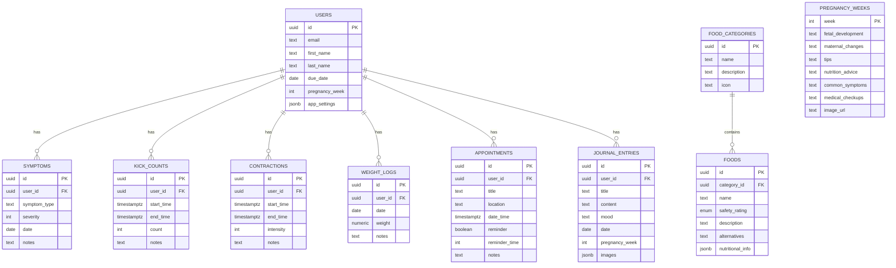

# Technical Context: BumpBuddy

_Version: 1.1_
_Created: 2025-05-06_
_Last Updated: 2025-05-19_

## Tech Stack

### Frontend

- React Native (Expo framework)
- TypeScript for type safety
- Nativewind for styling (TailwindCSS for react native)
- Redux Toolkit for state management
- React Navigation for routing
- i18next and react-i18next for internationalization
- Async Storage for local data persistence

### Backend

- Supabase (PostgreSQL, Auth, Storage, Realtime)
- Edge Functions for serverless logic (planned)

### Development

- Bun as package manager
- ESLint for code quality
- Jest for testing
- Expo Go for development testing

## Key Libraries and Versions

```json
{
  "dependencies": {
    "@expo/vector-icons": "^14.0.0",
    "@react-native-async-storage/async-storage": "1.21.0",
    "@react-navigation/bottom-tabs": "^6.5.11",
    "@react-navigation/native": "^6.1.9",
    "@react-navigation/native-stack": "^6.9.17",
    "@reduxjs/toolkit": "^2.2.1",
    "@supabase/supabase-js": "^2.40.0",
    "date-fns": "^3.3.1",
    "expo": "~50.0.0",
    "expo-localization": "~14.8.3",
    "expo-status-bar": "~1.11.1",
    "i18next": "^23.10.0",
    "react": "18.2.0",
    "react-i18next": "^14.0.5",
    "react-native": "0.73.2",
    "react-native-safe-area-context": "4.8.2",
    "react-native-screens": "~3.29.0",
    "react-native-url-polyfill": "^2.0.0",
    "react-redux": "^9.1.0"
  },
  "devDependencies": {
    "@babel/core": "^7.20.0",
    "@types/react": "~18.2.45",
    "typescript": "^5.1.3"
  }
}
```

## Styling Implementation

We've established a consistent styling approach using NativeWind (Tailwind CSS for React Native). Key aspects of our styling strategy include:

- Using className prop instead of StyleSheet.create for styling components
- Applying theme-aware conditional classes based on dark/light mode
- Implementing a design system with standardized color tokens and typography
- Creating reusable ThemedView and FontedText components for theme-aware styling
- Using inline style objects only when className is not supported by third-party components
- Converting all StyleSheet-based components to NativeWind for consistency
- Handling edge cases like flag icons in language selection for proper dark mode appearance

This approach ensures:

- Consistent styling throughout the application
- Better dark mode compatibility
- Improved code readability and maintainability
- Easier theme customization through a central design system

## File Structure

```
bumpbuddy/
├── App.tsx                  # Root component
├── app.json                 # Expo configuration
├── global.css               # CSS file configuration
├── tailwind.config.js       # Tailwind CSS file configuration
├── assets/                  # Static assets like images
├── babel.config.js          # Babel configuration
├── index.js                 # Entry point
├── package.json             # Dependencies
├── src/                     # Source code
│   ├── components/          # Reusable UI components
│   ├── config/              # Configuration files
│   │   └── supabaseConfig.ts # Supabase client setup
│   ├── constants/           # App-wide constants
│   ├── hooks/               # Custom React hooks
│   ├── i18n/                # Internationalization
│   │   ├── index.ts         # i18n configuration
│   │   └── languages/       # Translation files
│   │       ├── en.json
│   │       ├── es.json
│   │       └── fr.json
│   ├── navigation/          # Navigation setup
│   ├── redux/               # Redux state management
│   │   ├── slices/          # Redux toolkit slices
│   │   └── store.ts         # Redux store configuration
│   ├── screens/             # App screens
│   ├── services/            # API and data services
│   │   ├── foodService.ts   # Food database service
│   │   ├── realtimeService.ts # Realtime updates
│   │   └── timelineService.ts # Pregnancy timeline service
│   ├── types/               # TypeScript interfaces and types
│   └── utils/               # Utility functions
└── supabase/                # Supabase migrations and seeds
    └── migrations/          # Database migrations
        ├── food_safety_schema.sql
        └── seed_pregnancy_timeline_data.sql
```

## Environment Setup

- Expo development environment
- Supabase project with appropriate tables and RLS policies
- Environment variables for Supabase URL and API keys
- React Native debugger for development

## Database Schema

### User Management

**profiles**

```
profiles
  - id (UUID, PK)
  - email (TEXT, unique)
  - first_name (TEXT)
  - last_name (TEXT)
  - due_date (DATE)
  - pregnancy_week (INTEGER)
  - app_settings (JSONB)
  - created_at (TIMESTAMPTZ)
  - updated_at (TIMESTAMPTZ)
```

### Food Safety

**food_categories**

```
food_categories
  - id (UUID, PK)
  - name (TEXT)
  - description (TEXT)
  - icon (TEXT)
  - created_at (TIMESTAMPTZ)
  - updated_at (TIMESTAMPTZ)
```

**foods**

```
foods
  - id (UUID, PK)
  - category_id (UUID, FK to food_categories)
  - name (TEXT)
  - safety_rating (ENUM: 'safe', 'caution', 'avoid')
  - description (TEXT)
  - alternatives (TEXT)
  - nutritional_info (JSONB)
  - created_at (TIMESTAMPTZ)
  - updated_at (TIMESTAMPTZ)
```

### Health Tracking

**symptoms**

```
symptoms
  - id (UUID, PK)
  - user_id (UUID, FK to users)
  - symptom_type (TEXT)
  - severity (INTEGER 1-10)
  - date (DATE)
  - notes (TEXT)
  - created_at (TIMESTAMPTZ)
  - updated_at (TIMESTAMPTZ)
```

**kick_counts**

```
kick_counts
  - id (UUID, PK)
  - user_id (UUID, FK to users)
  - start_time (TIMESTAMPTZ)
  - end_time (TIMESTAMPTZ)
  - count (INTEGER)
  - notes (TEXT)
  - created_at (TIMESTAMPTZ)
  - updated_at (TIMESTAMPTZ)
```

**contractions**

```
contractions
  - id (UUID, PK)
  - user_id (UUID, FK to users)
  - start_time (TIMESTAMPTZ)
  - end_time (TIMESTAMPTZ)
  - intensity (INTEGER 1-10)
  - notes (TEXT)
  - created_at (TIMESTAMPTZ)
  - updated_at (TIMESTAMPTZ)
```

**weight_logs**

```
weight_logs
  - id (UUID, PK)
  - user_id (UUID, FK to users)
  - date (DATE)
  - weight (NUMERIC)
  - notes (TEXT)
  - created_at (TIMESTAMPTZ)
  - updated_at (TIMESTAMPTZ)
```

### Appointments & Calendar

**appointments**

```
appointments
  - id (UUID, PK)
  - user_id (UUID, FK to users)
  - title (TEXT)
  - description (TEXT)
  - location (TEXT)
  - date_time (TIMESTAMPTZ)
  - end_time (TIMESTAMPTZ)
  - reminder (BOOLEAN)
  - reminder_time (INTEGER) - minutes before
  - notes (TEXT)
  - created_at (TIMESTAMPTZ)
  - updated_at (TIMESTAMPTZ)
```

### Pregnancy Journey

**pregnancy_weeks**

```
pregnancy_weeks
  - week (INTEGER, PK)
  - fetal_development (TEXT)
  - maternal_changes (TEXT)
  - tips (TEXT)
  - nutrition_advice (TEXT)
  - common_symptoms (TEXT)
  - medical_checkups (TEXT)
  - image_url (TEXT)
```

**journal_entries**

```
journal_entries
  - id (UUID, PK)
  - user_id (UUID, FK to users)
  - title (TEXT)
  - content (TEXT)
  - mood (TEXT)
  - date (DATE)
  - pregnancy_week (INTEGER)
  - images (JSONB)
  - created_at (TIMESTAMPTZ)
  - updated_at (TIMESTAMPTZ)
```

### Database Diagram



## Security Model

- Row-Level Security (RLS) implemented for all user-related tables
- Authentication via Supabase Auth with JWT tokens
- User data isolated using RLS policies that check against auth.uid()
- Read-only access to reference data (food safety, pregnancy info)
- Secure data storage with encryption at rest

## Realtime Implementation

- **Publication**: Supabase Realtime configured with `supabase_realtime` publication
- **Tables**: Users table enabled for Realtime updates with appropriate RLS policies
- **Service**: `realtimeService.ts` manages subscriptions with typed interfaces
- **UI Integration**: ProfileScreen demonstrates real-time updates with status indicators
- **Testing**: Utility functions for simulating database changes during development

## Timeline Feature Implementation

### Key Technologies

- **AsyncStorage**: For caching timeline data with expiration policy
- **Redux Toolkit**: For state management of timeline data and UI state
- **Supabase**: For fetching pregnancy week data from PostgreSQL
- **TypeScript Interfaces**: For type safety in timeline-related data

### Timeline Service

- **Caching Strategy**: 24-hour expiration policy for cached data
- **Offline Support**: Ability to use cached data when offline
- **Data Filtering**: Functions to filter weeks by trimester
- **Current Week Calculation**: Logic to determine current week based on due date

### Timeline UI Components

- **TimelineScreen**: Main screen with trimester tabs and week listings
- **WeekDetailScreen**: Detailed view of a specific pregnancy week
- **Error Handling**: Robust handling of network errors and parsing issues
- **Refresh Mechanism**: Manual refresh option to clear cache and fetch fresh data

### Timeline Data Flow

1. User requests timeline data
2. App checks Redux store for data
3. If not in store, checks AsyncStorage cache
4. If valid cache exists, uses cached data
5. If no valid cache, fetches from Supabase
6. Updates Redux store and cache
7. Renders data to user

### Timeline Type Definitions

```typescript
// Key types for the Timeline feature
interface PregnancyWeek {
  week: number;
  fetal_development: string;
  maternal_changes: string;
  tips: string;
  nutrition_advice: string;
  common_symptoms: string;
  medical_checkups: string;
  image_url?: string;
}

interface TimelineService {
  getWeekInfo: (weekNumber: number) => Promise<PregnancyWeek | null>;
  getAllWeeks: () => Promise<PregnancyWeek[]>;
  getTrimesterWeeks: (trimester: 1 | 2 | 3) => Promise<PregnancyWeek[]>;
  calculateCurrentWeek: (dueDate: string | null) => number;
  getCurrentWeekInfo: (dueDate: string | null) => Promise<PregnancyWeek | null>;
  clearCache: () => Promise<void>;
}

interface TimelineState {
  allWeeks: PregnancyWeek[];
  weekData: PregnancyWeek | null;
  currentWeek: number;
  selectedWeek: number | null;
  loading: boolean;
  error: string | null;
}
```

---

_This document describes the technologies used in the project and how they're configured._
